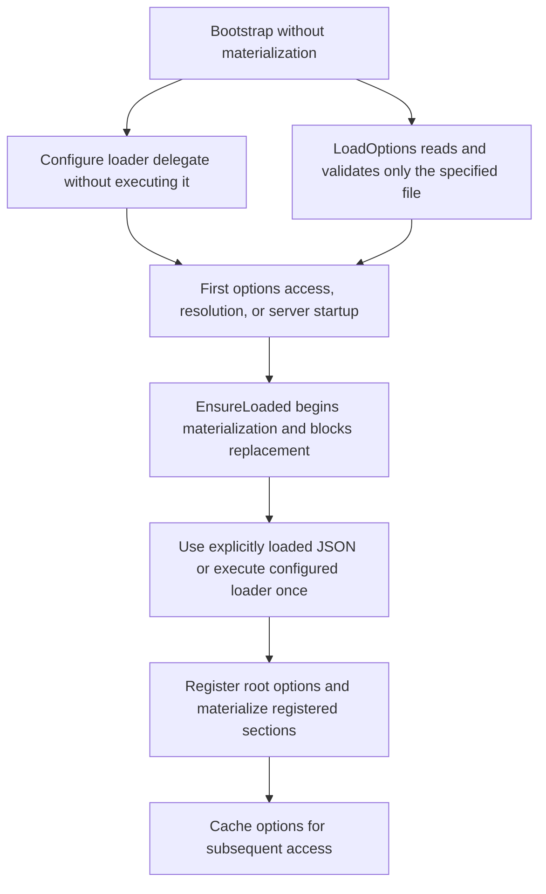

# Options and Configuration

The framework exposes typed configuration through `IOptions<T>` and `TOptions<T>`.

Core unit:

```text
Source/Core/Options.Port.pas
```

Registration/runtime unit:

```text
Source/Core/Options.Registry.pas
```

## Core types

Options are declared as classes that inherit from `TOptionsSection`.

```pascal
type
  TOptionsSection = class abstract
  protected
    function GetSectionName: string; virtual; abstract;
  public
    property SectionName: string read GetSectionName;
  end;

  IOptions<T: class> = interface
    function GetValue: T;
    property Value: T read GetValue;
  end;

  TOptions<T: class> = class(TInterfacedObject, IOptions<T>)
  end;
```

`TOptionsSection` defines the JSON section name. `IOptions<T>` is the dependency injected into services.

## Declaring an options class

Create a class that inherits from `TOptionsSection` and override `GetSectionName`.

Example:

```pascal
unit Logger.Options;

interface

uses
  Options.Port;

type
  TLoggerOptions = class(TOptionsSection)
  private
    FLogLevel: string;
    FFilePath: string;

    function GetSectionName: string; override;
  public
    property LogLevel: string read FLogLevel write FLogLevel;
    property FilePath: string read FFilePath write FFilePath;
  end;

implementation

function TLoggerOptions.GetSectionName: string;
begin
  Result := 'Logger';
end;

end.
```

Given this class, the configuration file must contain a `Logger` object:

```json
{
  "Logger": {
    "LogLevel": "INFO",
    "FilePath": "./Logs/app.log"
  }
}
```

The JSON property names are mapped to writable public/published properties in the options class.

## Consuming options

Dependencies consume options through `IOptions<TSpecificOptions>`.

```pascal
type
  TLogger = class(TInterfacedObject, ILogger)
  private
    FOptions: TLoggerOptions;
  public
    constructor Create(const AOptions: IOptions<TLoggerOptions>);
  end;

constructor TLogger.Create(const AOptions: IOptions<TLoggerOptions>);
begin
  inherited Create;
  FOptions := AOptions.Value;
end;
```

`AOptions.Value` returns the typed options object, for example `TLoggerOptions`.

## Root options

The framework uses a JSON root object.

Unit:

```text
Source/Core/App.Options.pas
```

Current type:

```pascal
type
  TAppOptions = TJSONObject;
```

The root JSON contains one object per registered section:

```json
{
  "HttpServer": {
    "Port": 8080
  },
  "Logger": {
    "LogLevel": "INFO",
    "FilePath": "./Logs/app.log"
  }
}
```

`HttpServer.Port` must be explicitly configured with an integer from `1` to
`65535`. The value `8080` above is only an example, not a fallback. Server
composition rejects a missing, zero, negative, or out-of-range port; a missing
`HttpServer` section is rejected by the options registry. The former
`THttpComposition.DefaultHttpPort` constant has been removed.

## Loader

The default loader is configured by `TAppContainer`.

Unit:

```text
Source/Core/App.Options.Loader.pas
```

The default loader is:

```pascal
TAppOptionsLoader.Execute
```

Without explicit configuration, `Execute` uses `LoadWithOverrides` to load
`Config/Config.json` and recursively merge an override file selected by
`APP_OPTIONS_FILE_PATH`, if present. This default/environment-based load is deferred
until `TOptionsRegistry.EnsureLoaded`.

The constructor configures the default loader without reading files.
`SetOptionsLoader` only configures the loader delegate; it does not execute it.
The loaded configuration is cached. Once materialization has begun, replacing
the loader or configuration is rejected with an error; there is no hot reload.

### Selecting a configuration file explicitly

Use `LoadOptions` during bootstrap to load exactly one configuration file:

```pascal
App := TAppContainer.Create;
try
  App.LoadOptions('./Config/Config.production.json');
  App.AddOptions<TLoggerOptions>;
  // Register and resolve application services after selecting the configuration.
finally
  App.Free;
end;
```

This delegates to `TAppOptionsLoader.LoadFromFile`: it immediately reads only
the specified file and validates that it contains a JSON object. It neither
reads nor merges `Config/Config.json`, and does not consult
`APP_OPTIONS_FILE_PATH`. The default file is not required for this explicit
load. An empty or whitespace-only path is rejected.

Reading and validating the root JSON does not materialize typed sections.
Registered sections, including `THttpServerOptions`, are materialized later by
`EnsureLoaded`, triggered by the first `GetGlobalOptions`, `GetOptions`, service
resolution, or server startup. Construction and `AddOptions` before first use
do not read any files, so no valid default/environment configuration is needed
before calling `LoadOptions`.

Call `LoadOptions` or `SetOptionsLoader` before materialization begins. Once it
has begun, replacing the configuration or loader is rejected with an error,
rather than replacing previously obtained options. This is a startup
configuration API, not a hot-reload mechanism.

### Breaking change: file loader behavior

`TAppOptionsLoader.LoadFromFile(path)` now loads exactly one file. Existing
callers that relied on its former default-plus-override merge must switch to
`TAppOptionsLoader.LoadWithOverrides(path)`. That method preserves the recursive
merge of `Config/Config.json` with the supplied override: override values win
and nested JSON objects are merged. `Execute` uses `LoadWithOverrides` for the
environment-based loading path. See [Configuration Files](13-configuration-files.md).

## Registering sections

Use `AddOptions<TOptions>` to expose a section as `IOptions<TOptions>`.

```pascal
Container.AddOptions<TLoggerOptions>;
Container.AddOptions<TDatabaseOptions>;
```

`TOptions` must inherit from `TOptionsSection` and implement `GetSectionName`.

```pascal
type
  TDatabaseOptions = class(TOptionsSection)
  private
    FConnectionString: string;

    function GetSectionName: string; override;
  public
    property ConnectionString: string read FConnectionString write FConnectionString;
  end;

function TDatabaseOptions.GetSectionName: string;
begin
  Result := 'Database';
end;
```

This registration exposes:

```pascal
IOptions<TDatabaseOptions>
```

and expects the root JSON to contain:

```json
{
  "Database": {
    "ConnectionString": "..."
  }
}
```

## Default options

`TAppContainer` registers HTTP server options by default:

```pascal
AddOptions<THttpServerOptions>;
```

Applications can register their own sections during bootstrap:

```pascal
App.AddOptions<TLoggerOptions>;
```

## Loading and registration behavior

- Construction configures the default loader and registers HTTP server options
  without reading files.
- `AddOptions<T>` before first use registers a section without reading files or
  materializing it.
- `SetOptionsLoader` configures a delegate without executing it.
- `LoadOptions(path)` immediately reads and validates only that file, but defers
  section materialization.
- `EnsureLoaded`, whether called directly or by the first `GetGlobalOptions`,
  `GetOptions`, service resolution, or server startup, materializes the options.
  Without an explicit load, it executes the configured loader at this point.
- Once materialization begins, loader/configuration replacement fails with an
  error. Subsequent access uses the cached configuration, not a hot reload.

The flow is:



## Important implementation detail

`IOptions<T>` instances are registered with an exact `TValue` for the closed generic interface, for example:

```pascal
IOptions<TLoggerOptions>
```

This avoids reconstructing generic interfaces dynamically during constructor invocation and keeps `AOptions.Value` safe when injected through RTTI.

## Notes

- Options sections are classes, not records.
- Every options section must inherit from `TOptionsSection`.
- `GetSectionName` determines the JSON object name in the root configuration.
- The root options value is a `TJSONObject`.
- Dependencies should consume `IOptions<TSpecificOptions>` instead of `TSpecificOptions` directly.
- `TOptions<T>` owns the contained options object and frees it when the options wrapper is destroyed.
